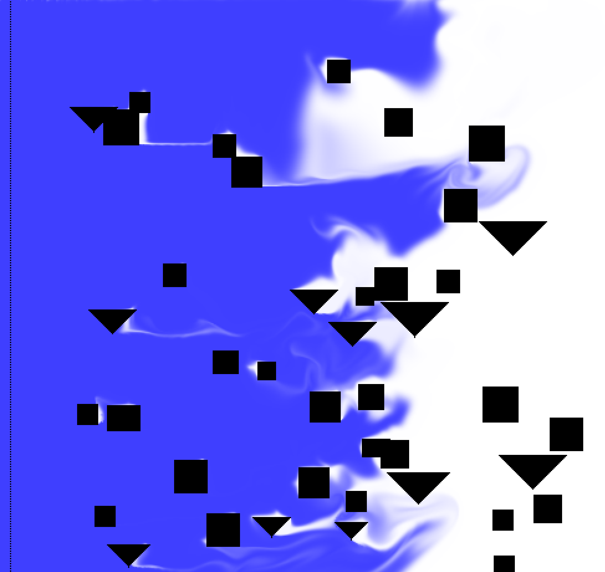

# 🌊 Fluid Simulation — TIPE

<p align="center">
  <strong>Numerical simulation of fluid flows for the study and optimisation of wind-assisted ship propulsion</strong>
</p>

<p align="center">
  
  
  
</p>

---

## 🖥️ Simulation

<p align="center">
  
  
</p>

<p align="center">
  
  
</p>

---

## 📖 About the project

This repository contains the numerical simulation developed for my **TIPE 2026**.

The project aims to build a controllable numerical model of a fluid interacting with solid objects, then use this model to study the aerodynamic consequences of different configurations for **wind-assisted ship propulsion**.

The project has progressively evolved from a basic fluid solver into a more complete simulation environment including:

- 🌬️ **Fluid velocity and density**
- 🧱 **Solid obstacles and walls**
- 📐 **Pressure and force computation**
- 🌀 **Flow interaction and wake formation**
- 📊 **Real-time force monitoring**
- 🖱️ **Interactive obstacle drawing**
- ⚙️ **Live simulation parameters**
- ⏸️ **Pause / resume controls**
- 📸 **Simulation screenshots**
- 🚢 **Ship and container-layout modelling**
- 🧮 **Comparison of different layouts**
- 🏆 **Layout scoring based on drag and torque**

The long-term objective is to connect the numerical fluid model with the optimisation of **wingsails** and ship configurations.

---

## 🎯 Scientific objective

Wind-assisted propulsion is an increasingly interesting approach to reducing fuel consumption and emissions from commercial ships.

A wingsail behaves in a similar way to an aircraft wing: an airflow around a suitable geometry creates a pressure distribution and therefore an aerodynamic force.

The project therefore aims to establish the following chain:

```text
                WIND
                  ↓
        ┌─────────────────┐
        │ Ship / Wingsail │
        └────────┬────────┘
                 ↓
        ┌─────────────────┐
        │ Fluid simulation│
        └────────┬────────┘
                 ↓
        Pressure / velocity
                 ↓
        Aerodynamic forces
                 ↓
       Geometry / layout study
                 ↓
             Optimisation
                 ↓
        ⛵ Wind-assisted
           propulsion
```

The final goal is to determine how geometry, flow conditions and ship configuration influence aerodynamic performance.

---

## 🧮 Numerical model

The simulation discretises the fluid domain into a two-dimensional computational grid.

Each cell contains information used to describe the local state of the fluid and its interaction with solid walls.

### Grid

Two grid implementations are currently present:

- **`Grid`** — the main grid implementation used by the interactive simulation.
- **`Grid2`** — an experimental implementation using a **Morton/Z-order encoding** for grid storage.

The program can select between several simulation modes through the `GRID` configuration.

### Fluid quantities

The model works with quantities including:

- fluid velocity,
- fluid density,
- viscosity,
- pressure,
- forces acting on solid objects,
- torque generated by the flow.

### Boundary conditions and obstacles

Solid objects are represented as walls inside the computational domain.

The interactive application also allows walls to be drawn directly with the mouse, making it possible to create or modify obstacles while the simulation is running.

### Forces

The simulation can compute the forces acting on objects and extract quantities such as:

- total drag,
- total torque,
- force components,
- force contributions associated with ship components and containers.

---

## 🖥️ Interactive simulation

The current interactive mode is based on a GPU-accelerated rendering pipeline using **`pixels` / `wgpu`**, with an **egui** interface.

The simulation window provides live controls for:

| Parameter | Description |
| --- | --- |
| 🌬️ **Flow velocity** | Controls the incoming fluid velocity |
| 🧊 **Flow density** | Controls the fluid density |
| 💧 **Viscosity** | Controls the viscosity parameter |
| 📉 **Drag weight** | Weight used for the drag component of the score |
| 🔄 **Torque weight** | Weight used for the torque component of the score |
| ⏸️ **Pause / Resume** | Stops or restarts the simulation |
| 📸 **Screenshot** | Saves the current simulation frame |

The application also displays a real-time plot of **drag and torque**.

### 🖱️ Interactive walls

While the simulation is running, the left mouse button can be used to draw walls directly onto the computational grid.

This makes it possible to quickly test different obstacle geometries without modifying the source code.

---

## 🚢 Ship and container layouts

The project now includes a dedicated module for studying **ship layouts and container placement**.

A `ShipLayout` describes:

- the ship hull geometry,
- the position and dimensions of containers,
- the flow direction associated with the tested configuration.

Containers and hull cells are labelled separately, allowing their respective force contributions to be extracted from the simulation.

### Layout evaluation

A layout can be simulated for a given number of steps and evaluated using:

- 🚢 **Hull force**
- 📦 **Force on each container**
- 📉 **Total drag**
- 🔄 **Total torque**
- 🏆 **Global score**

The current score is a weighted combination of drag and torque:

```text
score = W_DRAG × |drag| + W_TORQUE × torque
```

This provides a simple objective function for comparing different configurations.

### Layout comparison

Several layouts can be evaluated automatically and ranked according to their score.

```text
┌─────────────────────────┐
│     Ship configuration  │
└────────────┬────────────┘
             ↓
     Run fluid simulation
             ↓
     Compute wall forces
             ↓
   ┌─────────┴─────────┐
   ↓                   ↓
Hull forces      Container forces
   │                   │
   └─────────┬─────────┘
             ↓
      Total drag / torque
             ↓
        Global score
             ↓
      Layout comparison
```

This forms the basis for a future optimisation procedure.

---

## ⚙️ Available simulation modes

The program currently supports several execution paths selected through the `GRID` configuration:

| Mode | Purpose |
| --- | --- |
| `GRID = "1"` | Main `Grid` implementation and basic numerical tests |
| `GRID = "2"` | Experimental `Grid2` implementation using Morton/Z-order storage |
| `GRID = "3"` | Interactive simulation application |

The interactive mode is currently the main user-facing simulation environment.

---

## 🏗️ Project structure

```text
Fluid-simulation-TIPE/
│
├── assets/
│   ├── city_simulation.png
│   ├── test_protection (4).png
│   ├── Von Karman (1).png
│   └── Von Karman (3).png
│
├── src/
│   ├── app.rs
│   ├── conditions.rs
│   ├── grid.rs
│   ├── grid2.rs
│   ├── main.rs
│   ├── objects.rs
│   ├── pressure_computation.rs
│   ├── pressure_computation2.rs
│   ├── ship.rs
│   └── visualization.rs
│
├── TEST FUNCTIONS/
│
├── Cargo.toml
├── Cargo.lock
└── README.md
```

### Main modules

| File | Purpose |
| --- | --- |
| `main.rs` | Program entry point and simulation-mode selection |
| `app.rs` | Interactive simulation window, UI and real-time controls |
| `grid.rs` | Main computational grid |
| `grid2.rs` | Experimental Morton/Z-order grid |
| `conditions.rs` | Global simulation and physical parameters |
| `objects.rs` | Object detection and force-related structures |
| `pressure_computation.rs` | Pressure and wall-force computation |
| `pressure_computation2.rs` | Alternative pressure-computation implementation |
| `ship.rs` | Ship layouts, container placement and layout comparison |
| `visualization.rs` | Previous / supporting visualisation tools |

The code is intentionally divided into independent modules so that different numerical approaches can be tested and compared during the development of the TIPE.

---

## 🦀 Technologies

The project is written in **Rust**.

The repository currently relies on crates including:

- **Plotters** — data visualisation
- **minifb** — lightweight graphical windowing / legacy visualisation
- **Rayon** — parallel computation
- **Rand** — random number generation

The interactive application additionally uses a GPU-oriented rendering stack based on:

- **pixels**
- **wgpu**
- **egui**
- **egui-wgpu**
- **egui-winit**
- **winit**

Rust was chosen for its performance, memory safety and suitability for computationally intensive numerical simulations.

---

## 📊 From fluid simulation to optimisation

The project is structured around a progressive approach:

```text
┌──────────────────────────┐
│   Numerical fluid model  │
└────────────┬─────────────┘
             ↓
┌──────────────────────────┐
│ Pressure / velocity field│
└────────────┬─────────────┘
             ↓
┌──────────────────────────┐
│ Aerodynamic forces       │
└────────────┬─────────────┘
             ↓
┌──────────────────────────┐
│ Ship / wingsail geometry │
│ • hull                   │
│ • containers             │
│ • profile                │
│ • angle of attack        │
└────────────┬─────────────┘
             ↓
┌──────────────────────────┐
│ Performance evaluation   │
│ • drag                   │
│ • torque                 │
│ • score                  │
└────────────┬─────────────┘
             ↓
┌──────────────────────────┐
│ Configuration comparison │
└────────────┬─────────────┘
             ↓
┌──────────────────────────┐
│ Future optimisation      │
└──────────────────────────┘
```

The objective is not to immediately reproduce every aspect of real-world CFD, but to develop a numerical model that remains understandable and controllable while being sufficiently useful to investigate the physical phenomena relevant to the TIPE.

---

## 🔬 Current state

> 🚧 **Work in progress**

The project has moved beyond the initial fluid-flow prototype and now includes an interactive simulation environment as well as the first tools for studying ship layouts.

### Implemented

- [x] Two-dimensional computational grid
- [x] Fluid density and velocity modelling
- [x] Solid walls and obstacles
- [x] Pressure / wall-force computation
- [x] Object force and torque calculation
- [x] Interactive simulation window
- [x] Real-time physical parameters
- [x] Pause / resume
- [x] Interactive wall drawing
- [x] Real-time drag / torque plot
- [x] Screenshot export
- [x] Experimental Morton/Z-order grid
- [x] Ship hull representation
- [x] Container representation
- [x] Separate hull / container force extraction
- [x] Layout scoring
- [x] Comparison and ranking of layouts

### In development

- [ ] Improve the physical model
- [ ] Improve numerical stability
- [ ] Validate the simulation against analytical or experimental results
- [ ] Refine ship geometries
- [ ] Improve container-layout modelling
- [ ] Implement realistic wingsail geometries
- [ ] Study the influence of angle of attack
- [ ] Compare different wingsail profiles
- [ ] Develop a dedicated optimisation algorithm
- [ ] Connect the aerodynamic model to wind-assisted ship propulsion

---

## ⚠️ Limitations

The current model remains a simplified numerical representation of a fluid flow.

Real aerodynamic flows around ships and wingsails involve phenomena such as:

- viscosity,
- turbulence,
- boundary layers,
- flow separation,
- wake formation,
- three-dimensional effects.

The current simulation should therefore be interpreted as a **research and educational numerical model**, rather than as a complete CFD solver.

One of the main objectives of the project is to determine which level of physical modelling is sufficient to obtain useful results while keeping the simulation computationally tractable.

---

## 📈 Project philosophy

The project follows a progressive methodology:

**Model → Simulate → Measure → Compare → Validate → Optimise**

Rather than directly implementing a complex CFD solver, the objective is to understand and control each part of the numerical model.

This makes the simulation both:

- a **research tool** for the TIPE,
- and a way to investigate the underlying physical phenomena.

---

## 📚 Scientific context

This project is part of a broader study of **wind-assisted ship propulsion** and the optimisation of ship and wingsail configurations.

The numerical work aims to create a link between theoretical fluid mechanics and a practical engineering problem:

> **How can the geometry and operating conditions of a ship and its wingsail be optimised to maximise the useful aerodynamic force while limiting unwanted drag and torque?**

The simulation therefore focuses on building a controllable numerical framework that can progressively be extended toward more realistic ship and wingsail configurations.

---

## 👤 Author

**Astraheim**

**TIPE — 2026**

`Fluid Mechanics · Numerical Simulation · Aerodynamics · Wingsails · Ship Propulsion · Optimisation`

---

## 📜 License

This project is primarily intended for educational and research purposes as part of a **TIPE project**.
